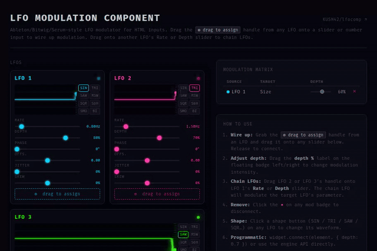

# lfocomp

**Drop an LFO onto any HTML input. Done.**



[](LICENSE)
[]()
[]()
[]()

**[Live demo](https://kush42.github.io/lfo.html)**

---

## What it is

A zero-dependency ES module that adds Ableton/Bitwig-style LFO modulation to any `<input type=range>` or `<input type=number>`. Drag the assign handle onto a slider. It modulates. That's it.

No npm install at runtime. No bundler. No framework. Serve the files, open the page, wire things up.

---

## Why this exists

Every existing approach is either:

- A full synthesizer library pulling in 400 KB of irrelevant code
- A half-finished CodePen someone wrote at 2am
- Something that requires a bundler, a framework, and three config files to get "hello sine wave"

lfocomp is one import, three files, and you're live.

---

## Install

### npm *(coming soon)*
```bash
npm install lfocomp
```
```js
import { createLFO } from 'lfocomp';
```

### CDN (no install)
```html
<script type="module">
  import { createLFO } from 'https://cdn.jsdelivr.net/npm/lfocomp/lfo-comp.js';
</script>
```

### Self-hosted
Download `lfo-comp.js`, `lfo-engine.js`, and `lfo-ui.js` into the same directory.
No build step required.

---

## Quick start

```bash
git clone https://github.com/KUSH42/lfocomp
cd lfocomp
npm run serve        # python3 -m http.server 8080
# open http://localhost:8080/demo.html
```

```js
import { createLFO } from './lfo-comp.js';

const { widget } = createLFO(document.querySelector('#lfo-panel'));

// Drag the ⊕ handle onto any slider — or wire programmatically:
widget.connect(document.querySelector('#my-slider'), { depth: 0.7 });
```

---

## Features

- **7 waveforms** — Sine, Triangle, Saw, Reverse Saw, Square, Sample & Hold, Smooth Random
- **Drag-to-assign** — pointer-captured drag wire, highlights valid targets on hover
- **LFO chaining** — drag LFO B's handle onto LFO A's Rate or Depth slider to chain them. Rate modulation is multiplicative (`rate × (1 + src × depth)`), so it never goes to zero
- **Per-cycle jitter** — randomises each cycle's duration independently; visible as variable-width cycles in the waveform view
- **Waveform skew** — warps the phase midpoint, turning a sine into something between a shark fin and a reverse ramp
- **Modulation matrix** — live table of all active routes with adjustable depth sliders and one-click delete
- **ModIndicator badges** — floating badges anchored to each connected input with drag-to-adjust depth and a range arc showing the sweep zone
- **Bipolar / unipolar toggle** — BI/UNI button on the widget switches output between ±1 and 0–1
- **Click-to-type param values** — click any value readout to type an exact number; Enter commits, Escape cancels

---

## Technical deep dive: the oscilloscope buffer

Most LFO visualisers recompute the waveform from the current phase on every frame. That approach has two problems: it can't show jitter (because jitter is stochastic per-cycle, not a formula), and it makes speed changes look instant instead of gradual.

lfocomp records the *actual output value* on every engine tick into a `Float32Array` ring buffer:

```js
// Engine tick → subscribe callback → _recordSample(currentValue)
this._wfHistory.copyWithin(0, intShift);          // shift left, O(1) typed-array copy
for (let i = 0; i < intShift; i++) {
  const t = (i + 1) / intShift;
  this._wfHistory[W - intShift + i] = prev + (cur - prev) * t;  // linear interpolation
}
```

The cursor advances at a fixed wall-clock rate (`W / 4` px/sec — always a 4-second window) regardless of LFO rate, so a 0.1 Hz LFO and a 10 Hz LFO both scroll at the same speed. Only the cycle density changes.

The visible canvas is composited from an offscreen `willReadFrequently` buffer. Only `intShift` new columns are painted per frame via `getImageData`/`putImageData` — no full redraws at 60 fps.

---

## API

```js
// Create
const { lfoId, widget } = createLFO(containerEl, {
  shape:   'sine',   // 'sine'|'triangle'|'saw'|'rsaw'|'square'|'random'|'smooth'
  rate:    1.0,      // Hz (0.01–10)
  depth:   1.0,      // 0–1
  phase:   0.0,      // 0–1 (0.5 = 180° offset)
  offset:  0.0,      // DC offset, -1–1
  bipolar: true,     // true = ±1 output, false = 0–1
  color:   '#00d4ff',
  label:   'LFO 1',
});

// Connect
const routeId = widget.connect(element, { depth: 0.5 });

// Disconnect
disconnect(routeId);

// Inspect
getRoutes();           // → RouteState[]
engine.getLFO(lfoId);  // → full LFO state object
engine.getAllRoutes();
```

### LFO chain routes (programmatic)

```js
// LFO 2 modulates LFO 1's rate at 40% depth
engine.addRoute(lfo2Id, 'lfo', lfo1Id, 'rate',  { depth: 0.4 });
engine.addRoute(lfo2Id, 'lfo', lfo1Id, 'depth', { depth: 0.3 });
```

---

## File structure

```
lfocomp/
├── lfo-engine.js   Core: LFO state machine, tick loop, route graph
├── lfo-ui.js       DOM: canvas widget, ModIndicator badge, drag wire
├── lfo-comp.js     Public API: createLFO(), connect(), disconnect()
├── demo.html       Interactive demo — open after npm run serve
├── tests/          Unit tests (vitest, jsdom)
```

The three files are fully independent of each other except in one direction: `lfo-ui.js` imports from `lfo-engine.js`, and `lfo-comp.js` imports from both. Nothing imports from the outside.

---

## Running tests

```bash
npm test            # vitest run
npm run test:watch  # watch mode
```

Tests cover engine math and route management. DOM-dependent behaviour (drag, canvas) is not tested — use the demo.

---

## License

MIT
